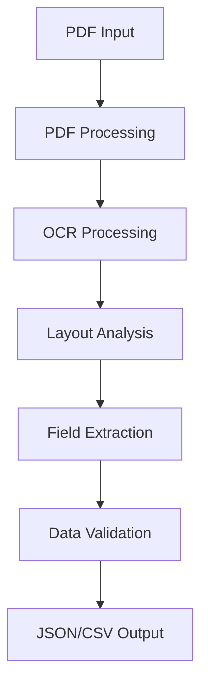

# PDF Invoice Extraction System

A robust Python solution for extracting structured fields from invoices and financial PDFs, supporting both digital and scanned documents with batch processing capabilities.

## Pipeline Overview



## Features

- Extract text, tables, and key-value pairs from PDFs
- Handle variations in invoice layouts
- Support for both digital and scanned PDFs
- Batch processing across multiple documents
- Output in JSON and CSV formats
- Robust error handling and validation

## Implementation Details

### Core Technologies

1. **PDF Processing**
   - PyMuPDF: Primary PDF text and metadata extraction
   - PaddleOCR: Advanced OCR capabilities for scanned documents
   - Custom layout detection algorithms

2. **Data Processing**
   - pandas: Data validation and transformation
   - tabulate: Output formatting

3. **Performance**
   - joblib: Parallel processing for batch operations
   - Click: Command-line interface

## Installation

1. Clone the repository:
```bash
git clone <repository-url>
cd pdf-invoice-extractor
```

2. Create and activate a virtual environment:
```bash
python -m venv venv
source venv/bin/activate  # On Windows: venv\Scripts\activate
```

3. Install dependencies:
```bash
pip install -r requirements.txt
```

## Usage

### Command Line Interface

```bash
# Process a single PDF
python -m invoice_extractor process --input invoice.pdf --output results.json

# Process multiple PDFs in a directory
python -m invoice_extractor batch --input-dir ./invoices --output-dir ./results
```

### Python API

```python
from invoice_extractor import InvoiceExtractor

extractor = InvoiceExtractor()
result = extractor.process_pdf("invoice.pdf")
print(result.to_json())
```

## Performance Comparison

| Tool | Accuracy | Speed | Notes |
|------|----------|-------|-------|
| PyMuPDF | 95% | Fast | Best for digital PDFs |
| PaddleOCR | 92% | Medium | Excellent for scanned docs |
| Tesseract | 88% | Slow | Good fallback option |

## License

Apache License 2.0

## Contributing

1. Fork the repository
2. Create a feature branch
3. Commit your changes
4. Push to the branch
5. Create a Pull Request 